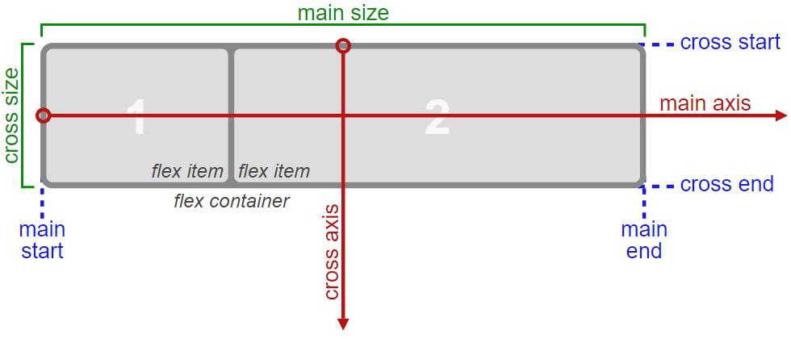

# Fundamentos de Flexbox CSS

Flexbox CSS es un sistema de maquetación **unidimensional**, pensado principalmente para el acomodo interno de los elementos, componentes y/o widgets de una interfaz de usuario.

<a href="https://www.youtube.com/watch?v=AAtvnv6LNMk">Ver video</a>

## Conceptos Básicos

- Contenedor Padre (**Flex Container**).
- Elementos Hijos (**Flex Items**).
- Eje Principal (**Main Axis**)
- Eje Transversal (**Cross Axis**).



<a href="https://www.youtube.com/watch?v=1NBMqQkcZ9Y">Ver video</a>

## **Propiedades CSS**

_Flexbox_ tiene 14 propiedades CSS, 8 que aplican al contenedor padre y 6 a los elementos hijos, a continuación te doy una definición muy puntual sobre cada propiedad, así como los posibles valores que pueden aceptar.

El primer valor que enlisto en cada propiedad es el que toman por defecto.

### **Propiedades del contenedor padre**

**display**: Define que una caja será _flexbox_ de bloque o _flexbox_ de línea.

```css
display: flex | inline-flex;
```

**flex-direction**: Define el eje principal _(main axis) row - X, column - Y_.

```css
flex-direction: row | row-reverse | column | column-reverse;
```


**flex-wrap**: Define si la caja _flexbox_ envuelve o **NO** a sus hijos.

```css
flex-wrap: nowrap | wrap | wrap-reverse;
```


**flex-flow**: Es un _shorthand_ de _flex-direction_ y _flex-wrap_.

```css
flex-flow: flex-direction flex-wrap;
```

<a href="https://www.youtube.com/watch?v=lnWBQ3dMzhw">Ver video</a>

**justify-content**: Define la alineación de los hijos en el eje principal (_main axis_).

```css
justify-content: flex-start | center | flex-end | space-between | space-around |
  space-evenly;
```


<a href="https://www.youtube.com/watch?v=4eHB6O8d1R0">Ver video</a>

**align-items**: Define la alineación de los hijos en el eje transversal (_cross axis_), dentro de cada línea.

```css
align-items: stretch | flex-start | flex-end | center | baseline;
```


**align-content**: Define la alineación de los hijos en el eje transversal (_cross axis_), **NO** funciona cuando los hijos están en **UNA** sóla línea (es decir cuando _flex-wrap_ tiene el valor de _nowrap_, **NO FUNCIONA**).

```css
align-content: flex-start | flex-end | center | space-between | space-around |
  space-evenly | stretch;
```

<a href="https://www.youtube.com/watch?v=ELP5l8IVSJo">Ver video</a>

### **Propiedades de los elementos hijos**

**flex-grow**: Cuando la caja _flexbox_ tenga espacio sobrante, es la **habilidad** o el **factor** de **crecer**, valor por defecto es 0, **NO** se aceptan valores negativos.

```css
flex-grow: 0;
```

<a href="https://www.youtube.com/watch?v=Ib9cYYBNQ10">Ver video</a>

**flex-shrink**: Cuando la caja _flexbox_ **NO** tenga espacio sobrante, es la **habilidad** o el **factor** de **encogerse**, valor por defecto es 1, **NO** se aceptan valores negativos.

```css
flex-grow: 1;
```

<a href="https://www.youtube.com/watch?v=cN6O13okUww">Ver video</a>

**flex-basis**: Es el tamaño del elemento hijo dentro de la línea de la caja _flexbox_.

- Si la caja _flexbox_ tiene dirección de fila, _flex-basis_ representa el _width_.
- Si la caja _flexbox_ tiene dirección de columna, _flex-basis_ representa el _height_.
- Valor por defecto _auto_.

```css
flex-basis: auto | 100px | 2rem | 50% | etc...;
```

**flex**: Es un _shorthand_ de las propiedades _flex-grow_, _flex-shrink_ y _flex-basis_, en ese orden.

```css
flex: 0 1 auto;
```

<a href="https://www.youtube.com/watch?v=jst2jcHDAWA">Ver video</a>

**order**: Representa el orden que tendrán los elementos hijos en la caja _flexbox_.

- Valor por defecto 0.
- Se aceptan valores positivos y negativos.
- Un valor menor siempre irá antes que un valor mayor.

```css
order: 0 | 1 | 2 | -3 | etc...;
```

**align-self**: Sobreescribe el valor de la propiedad _align-items_ sólo para el elemento hijo especificado.

```css
align-self: stretch | flex-start | flex-end | center | baseline;
```


<a href="https://www.youtube.com/watch?v=u-k1kPtOA5o">Ver video</a>

-
-
-
-

## Fuente: https://jonmircha.com/flexbox
